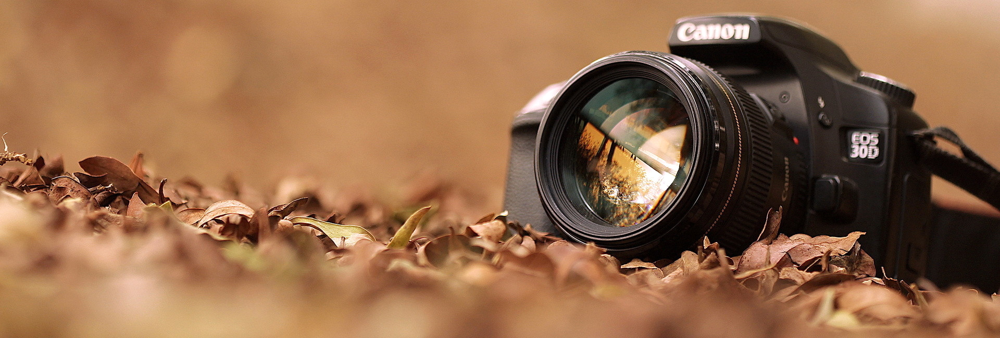
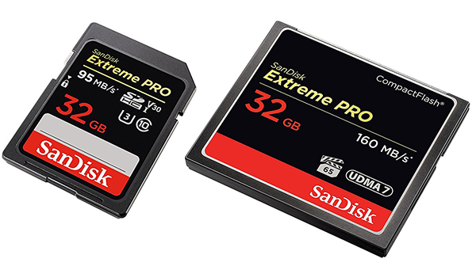
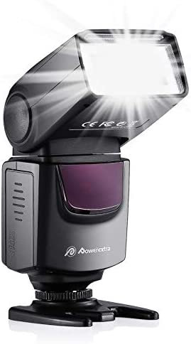

<h5>Photography is the art of capturing photographic images to later remember as they grow older. The definition of photography is the art or practice of taking and processing photographs. Photography is used in many scenarios such as capturing family photos, identifying a specific person or object,  creating creative art, and many more. Photography is beneficial in many ways as well because it allows for memorable moments to be physically visualized and it also allows people to document specific people or events.</h5>

  

    

      

        
        

          
Camera - A camera is an optical instrument that can capture an image.A camera is an optical instrument that can capture an image.

        

      

    

    

      

        
        

          
Memory Card - A memory card is an electronic data storage device used for storing digital information, typically using flash memory. These are commonly used in digital portable electronic devices. They allow adding memory to such devices using a card in a socket instead of protruding USB flash drives. 

        

      

    

    

      

        
        

          
Flash - For taking pictures in a dark environment or to shape the shine on your object

        

      

    

  

  

    

      

        
        

          
Gimp - It can be used as a simple paint program, retouching program, an online batch processing system, a mass production image renderer, an image format converter, etc.

        

      

    

    

      

        
        

          
Adobe Photoshop - Photoshop is where editors crop photos, adjust photo composition, correct lighting, and make any subject imaginable look its absolute best.

        

      

    

    

      

        
        

          
Photoscape - PhotoScape provides the ability to complete common image adjustments including color adjustment, cutting, resizing, printing and GIF animation.

        

      

    

  

