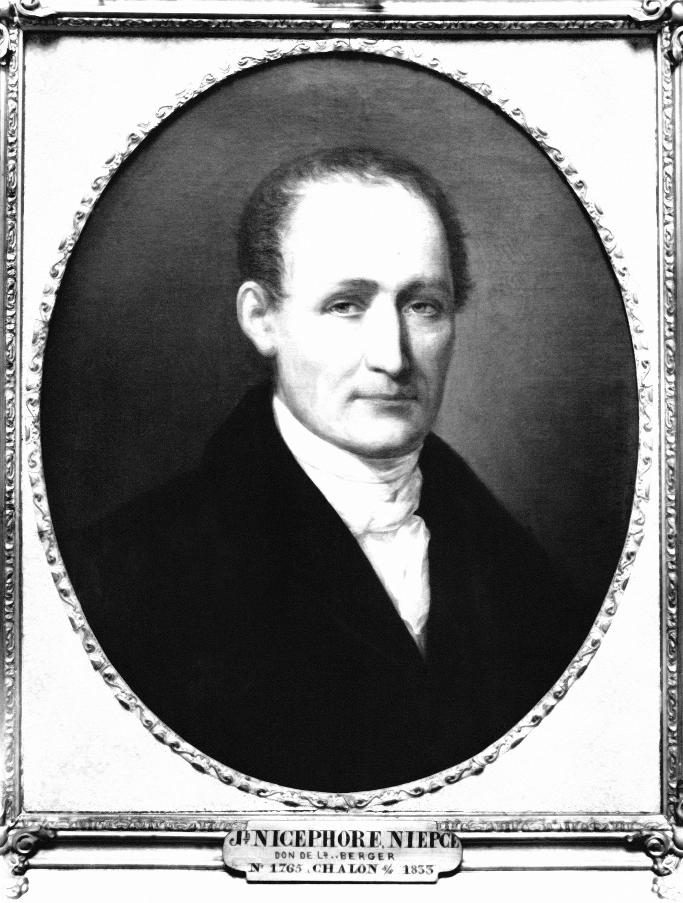
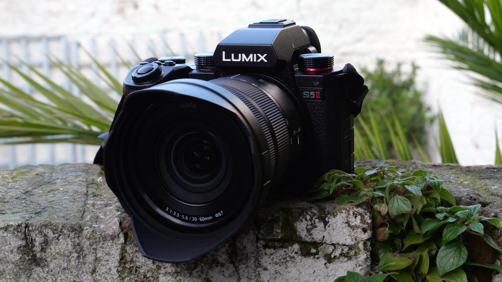
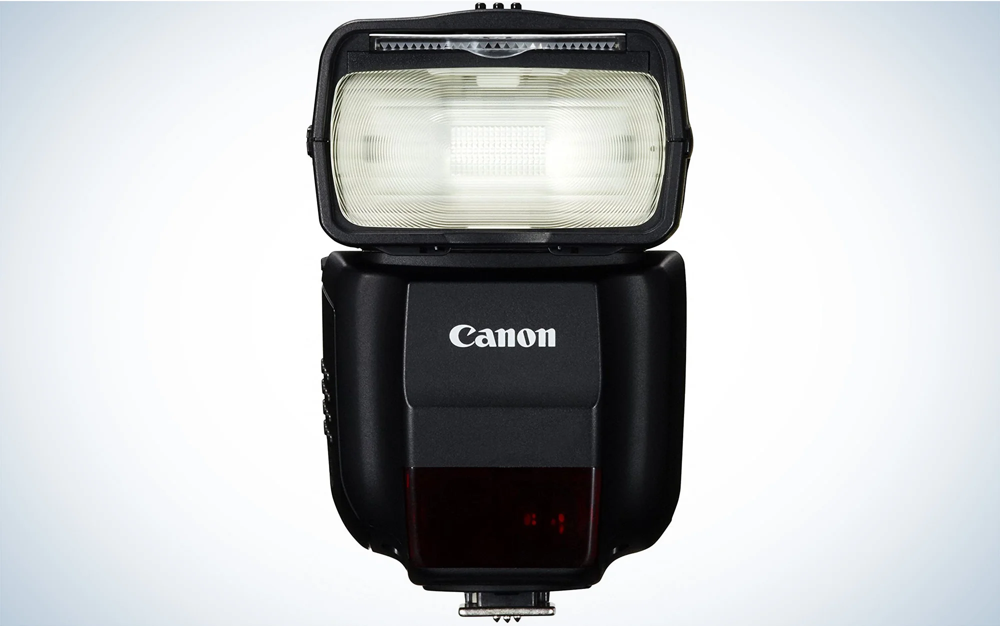

  
  
Photography

<h5>Photography is the art of capturing photographic images to later remember as they grow older. The definition of photography is the art or practice of taking and processing photographs. Photography is used in many scenarios such as capturing family photos, identifying a specific person or object, creating creative art, and many more. Photography is beneficial in many ways as well because it allows for memorable moments to be physically visualized and it also allows people to document specific people or events. There are many programs and equipment that are utilized in photography. Most professional photographers used programs such as Adobe Photoshop or Gimp, etc to create phenomenal images from simple photos.</h5>

<h3 class="text-center">Invented</h3>
<h5>Photography was invented by Frenchman Nicéphore Niépce in 1822. Niépce developed a technique called heliography, which he used to create the world's oldest surviving photograph, View from the Window at Le Gras (1827). Heliography was conceived in response to camera obscura theories dating back to ancient history.</h5>

  

    

      

        
        

        <h5 class="card-title">CAMERA</h5>
          
 A camera is an optical instrument that can capture an image.A camera is an optical instrument that can capture an image.
 
          <h5>HOW DOES IT WORK</h5>
          
A camera lens takes all the light rays bouncing around and uses glass to redirect them to a single point, creating a sharp image.

        

      

    

    

      

        
        

        <h5 class="card-title">MEMORY CARD</h5>
          
 A memory card is an electronic data storage device used for storing digital information, typically using flash memory. These are commonly used in digital portable electronic devices. They allow adding memory to such devices using a card in a socket instead of protruding USB flash drives. 

          <h5>HOW DOES IT WORK</h5>
          
Memory cards stores data on electronic components called NAND chips,the term NAND is short for "NOT AND," a boolean operator and logic gate.

        

      

    

    

      

        
        

        <h5 class="card-title">FLASH</h5>
          
 For taking pictures in a dark environment or to shape the shine on your object

          <h5>HOW DOES IT WORK</h5>
          
Emits an area with light for a microsecond to allow photographers to eliminate or create deeper shadows.

        

  

    

      

        
        

        <h5 class="card-title">GIMP</h5>
          
 It can be used as a simple paint program, retouching program, an online batch processing system, a mass production image renderer, an image format converter, etc.

          <h5>HOW DOES IT WORK</h5>
          
GIMP can be used a paint editor, photo retouching program, image renderer and an image renderer.

        

      

    

    

      

        
        

        <h5 class="card-title">ADOBE PHOTOSHOP</h5>
          
 Photoshop is a paid program where editors crop photos, adjust photo composition, correct lighting, and make any subject imaginable look its absolute best.

          <h5>HOW DOES IT WORK</h5>
          
Photoshop uses a layer-based or mathematics systems that allows raster image creation or mathematical calcualations to scale an image including altering with multiple overlays.

        

      

    

    

      

        
        

        <h5 class="card-title">PHOTOSCAPE</h5>
          
 PhotoScape provides the ability to complete common image adjustments including color adjustment, cutting, resizing, printing and GIF animation.

          <h5>HOW DOES IT WORK</h5>
          
Photoscape features common photo enhancements including color adjustment, cutting, resizing, printing and GIF animation, insert an image and be creative.

        

      

    

  

      

  
      

      <h3 class="text-center">Future Developments?</h3>
    <h5>An idea that i've thought about over a few days is a program that would allow you to adjust or correct the quality of an older photo. This would mean giving black and white photos color or filling in blurry areas in a blurry picture. This would allow people to treasure photos for longer periods of time without having to risk losing important memories or moments.</h5>
  

    

      

        

  

